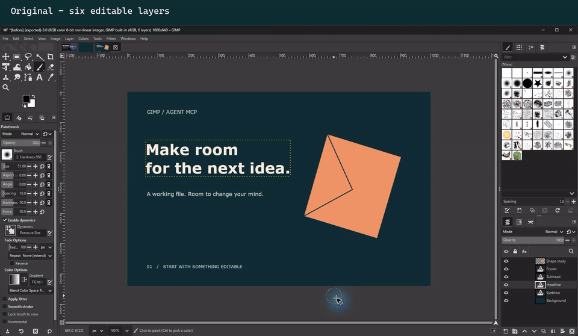

# GIMP Agent MCP

**Let your AI agent edit in GIMP. Keep the layers. See what changed.**

[](https://github.com/SarutobiSasuke8/gimp-agent-mcp/actions/workflows/ci.yml)
[](https://github.com/SarutobiSasuke8/gimp-agent-mcp/actions/workflows/live-windows.yml)
[](https://github.com/SarutobiSasuke8/gimp-agent-mcp/actions/workflows/live-linux.yml)
[](https://github.com/SarutobiSasuke8/gimp-agent-mcp/actions/workflows/live-macos.yml)
[](https://pypi.org/project/gimp-agent-mcp/)
[](LICENSE)

<!-- mcp-name: io.github.SarutobiSasuke8/gimp-agent-mcp -->

Connect Claude, Codex, Cursor or another MCP client to GIMP 3. The agent can work in your open window, inspect the result, refine an edit and save an XCF you can keep working on. Headless mode runs the same workflows over folders of images.

## See it working



[Watch the 20-second MP4](https://github.com/SarutobiSasuke8/gimp-agent-mcp/raw/main/docs/gimp-demo.mp4) · [Open the editable XCF](docs/layered-demo.xcf) · [Reproduce the MCP session](scripts/gui_demo.py)

This is a captured-step walkthrough of the real GIMP window, with pauses shortened. Three text layers are changed through MCP in one batch. One Ctrl+Z restores all three; Ctrl+Y brings them back. The text, artwork and background stay on separate named layers. This demonstrates actual tool execution, not a claim that every model will follow the same plan from a prompt.

## Try asking

> “Change the headline and supporting text in this card. Keep them as text layers, group the edits into one undo step, and show me the result before exporting.”

> “Make this transparent artwork into a Telegram sticker with a white outline and shadow. Save a 512 × 512 PNG.”

> “Pack these equal-sized PNG frames into a sprite sheet. Keep an XCF master, write the atlas JSON and verify the exported pixels against the originals.”


The included skills guide layered artwork, sprite sheets and batch jobs. They tell the agent to inspect and measure the actual output before calling a job complete.

## Install

You need **GIMP 3.2.x**, **Python 3.11+**, [uv](https://docs.astral.sh/uv/) and an MCP client. GIMP must be installed on the same machine as the server. Start GIMP once so its user profile exists.

```bash
uvx gimp-agent-mcp install-plugin
uvx gimp-agent-mcp install-skills
uvx gimp-agent-mcp doctor
```

Restart GIMP after installing or upgrading the bridge. In your open GIMP window, choose **Filters → Development → Start Agent Bridge**.

Add this configuration to your client's MCP settings:

```json
{
  "mcpServers": {
    "gimp": {
      "command": "uvx",
      "args": ["gimp-agent-mcp", "serve"]
    }
  }
}
```

For Claude Code:

```bash
claude mcp add gimp -- uvx gimp-agent-mcp serve
```

Claude Code can also install the server and skills as a plugin; see [skills installation](docs/SKILLS.md). For AI background removal, install the optional model runtime with `uvx --from "gimp-agent-mcp[segmentation]" gimp-agent-mcp serve` (use the same arguments in your MCP config). The first use downloads a model; image processing stays local.

**Working from source?** Run `uv sync --extra dev`, then `uv run gimp-agent-mcp install-plugin`. Configure the server as `uv run --no-sync --directory /absolute/path/to/repo gimp-agent-mcp serve`. `--no-sync` avoids Windows executable-lock errors when another server is running.

## Work in your window, or run a batch

- **Your existing window:** start the bridge from the menu. Continue editing the same document by hand.
- **A shortcut:** `uvx gimp-agent-mcp shortcut` creates a launcher that starts GIMP with the bridge enabled.
- **Agent-launched:** `gimp_launch(mode="gui")` opens GIMP; `mode="headless"` runs without a window.

Use `gimp_context(image_id)` to read selected layers and selection bounds. With several images open, the agent must choose an explicit image ID; GIMP's public API does not reliably expose which document has keyboard focus. `gimp_context(..., present=true)` can bring a specified document forward. If multiple bridges run, `gimp_status` follows the newest bridge file; isolate test profiles when a user session is active.

## What makes this useful

| Capability | What you get |
|---|---|
| Visual feedback | Whole-image, layer and region previews; saved snapshots; before/after/diff comparisons. Diagnostic overlays can add a coordinate grid, layer boxes, selection bounds and labelled points without changing the source. |
| Measured output | Pixel colours, alpha bounds, histograms and dominant colours. Sprite packing reopens the exported PNG and compares each cell's decoded RGBA pixels with its source. |
| Editable work | Named layers, text, paths, masks and non-destructive layer effects. Export an XCF master and delivery files separately. |
| Everyday editing | Three compact tools cover common adjustments, canvas transforms, fills and simple drawing. Every action reports the installed GEGL or PDB operation it used. |
| One undo step | `gimp_edit_batch` groups supported edits on one image into one Ctrl+Z step. A failed step stops the batch, reports partial results and closes the group. |
| Runtime discovery | Search and describe the installed PDB procedures and GEGL operations, including parameter names, types and enum values. Numeric-array arguments support curves and brush strokes. |
| Repeatable jobs | Nine recipes and folder batching, plus three bundled workflow skills. |
| Honest failure handling | A lost connection never silently replays an edit whose outcome is unknown. Reconnect, inspect, then decide whether to retry. |

Other GIMP MCP projects also provide TCP bridges and visual feedback. This project's emphasis is editable output, measurement, grouped edits and reproducible validation. Generic API access is broad, but does not guarantee that every GIMP procedure or GEGL operation works with every argument combination.

## Tools (39)

| Area | Tools |
|---|---|
| Learn and connect | `gimp_help`, `gimp_status`, `gimp_launch`, `gimp_shutdown`, `gimp_context` |
| Images | `gimp_list_images`, `gimp_image_info`, `gimp_new_image`, `gimp_open`, `gimp_export`, `gimp_close_image` |
| See and measure | `gimp_render`, `gimp_snapshot`, `gimp_drop_snapshot`, `gimp_render_compare`, `gimp_measure` |
| PDB | `gimp_pdb_search`, `gimp_pdb_describe`, `gimp_pdb_call` |
| Filters | `gimp_filter_search`, `gimp_filter_describe`, `gimp_apply_filter`, `gimp_layer_effects`, `gimp_layer_effect` |
| Everyday edits | `gimp_adjust`, `gimp_canvas`, `gimp_draw` |
| Structured edit | `gimp_edit_batch`, `gimp_select`, `gimp_layer_mask`, `gimp_layer`, `gimp_text`, `gimp_list_fonts`, `gimp_path` |
| Cut out | `gimp_remove_background` (optional rembg model runtime) |
| Automate | `gimp_run_python`, `gimp_list_recipes`, `gimp_run_recipe`, `gimp_batch_recipe` |

Images and items use integer IDs. Colours accept hex, common names, CSS RGB strings or component arrays; enums use nicks returned by the describe tools. Call `gimp_help("batch")` for grouped-edit examples. `gimp_run_python` may be disabled, reducing the tool count by one.

Common work no longer needs procedure discovery. For example, use `gimp_adjust(layer_id, "brightness_contrast", {"brightness": 0.15})`, `gimp_canvas(image_id, "crop", width=1200, height=630, x=40, y=20)`, or `gimp_draw(image_id, layer_id, "line", color="#ffffff", x=20, y=40, x2=300, y2=40, line_width=6)`. Adjustments default to editable layer effects where GIMP supports them; canvas and drawing actions bake pixels or structure. Every result identifies the runtime operation selected before execution.

For visual placement, ask for a diagnostic preview without marking the working image:

```text
gimp_render(image_id=3, overlay=["grid", "layers", "selection"], grid_size=100,
            points=[{"x": 600, "y": 340, "label": "headline centre"}])
```

## Recipes

| Recipe | Job |
|---|---|
| `telegram_sticker` | Fit, outline and shadow on a transparent 512 × 512 canvas. |
| `compose` | Cards and banners from a manifest of images, text, shapes and effects. |
| `sprite_sheet_pack` | Ordered, equal-sized PNGs → verified grid PNG, layered XCF and atlas JSON. |
| `sprite_sheet_slice` | Fixed-size tiles from a sheet, optionally skipping empty cells. |
| `web_optimise` | Resize and adjust export quality toward a file-size budget. |
| `icon_set` | Export a square source at multiple sizes. |
| `watermark` | Position a text or image watermark. |
| `contact_sheet` | Labelled thumbnails from a folder. |
| `fit_and_export` | Fit to a maximum edge and export by extension. |

[Recipe arguments and examples](docs/RECIPES.md) · [Skills](docs/SKILLS.md)

## Tested scope and limits

Version **0.5.0**, beta. Tested with Windows GIMP **3.2.4**, Linux GIMP **3.2.2** (Ubuntu 26.04), and macOS 15 GIMP **3.2.4** on Apple Silicon and Intel. Each platform runs the full smoke suite, targeted capability proof and all 23 everyday editing actions against real GIMP. GIMP 2.10 is unsupported; earlier 3.x releases are not part of the current test matrix.

- `gimp_edit_batch` accepts bounded layer, text, selection, path, mask and filter edits. It does not keep a transaction open between separate agent calls or automatically roll back a failed batch. The human uses GIMP's Undo/Redo; there is no invented programmatic undo endpoint.
- Some GEGL source operations, including linear gradients, are not drawable filters. Use the PDB gradient-fill procedure instead. Vector warp/liquify parity is not claimed.
- Sprite packing currently takes equal-sized PNG files, without padding or direct open-layer input. It does not align animation or pack mixed-size rectangles.
- Long filters are synchronous. Mid-filter cancellation and progress reporting remain follow-up work.

## Verify your setup

```bash
uvx gimp-agent-mcp smoke
# From the source checkout:
uv run pytest
uv run python scripts/capability_proof.py /path/to/proof-output
uv run python scripts/everyday_proof.py /path/to/proof-output
```

CI checks supported Python versions, and separate jobs exercise real GIMP on Windows, Linux and both macOS architectures. Release publication depends on all three real-GIMP workflows passing. The general capability proof measures curves, gradients and brush output and checks batch recovery, document boundaries, diagnostic overlays, nested previews and snapshot cleanup. A second proof resolves and exercises every action in `gimp_adjust`, `gimp_canvas` and `gimp_draw`, recording dimensions, layer counts and measured pixels. See [validation details](docs/VALIDATION.md).

## Architecture and trust

`MCP client → stdio server → authenticated loopback TCP → plug-in inside GIMP`

The plug-in runs operations on its GLib main loop, without worker threads. It uses a per-install token and only binds to `127.0.0.1`. PDB calls, recipes and Python can execute code with your user permissions: connect only trusted clients. Disabling `gimp_run_python` is not a sandbox. [Security](SECURITY.md) · [Architecture](docs/ARCHITECTURE.md)

Clean-room implementation under Apache-2.0; no code copied from other GIMP MCP projects. [Roadmap](ROADMAP.md) · [Changelog](CHANGELOG.md) · [Report a bug](https://github.com/SarutobiSasuke8/gimp-agent-mcp/issues)
