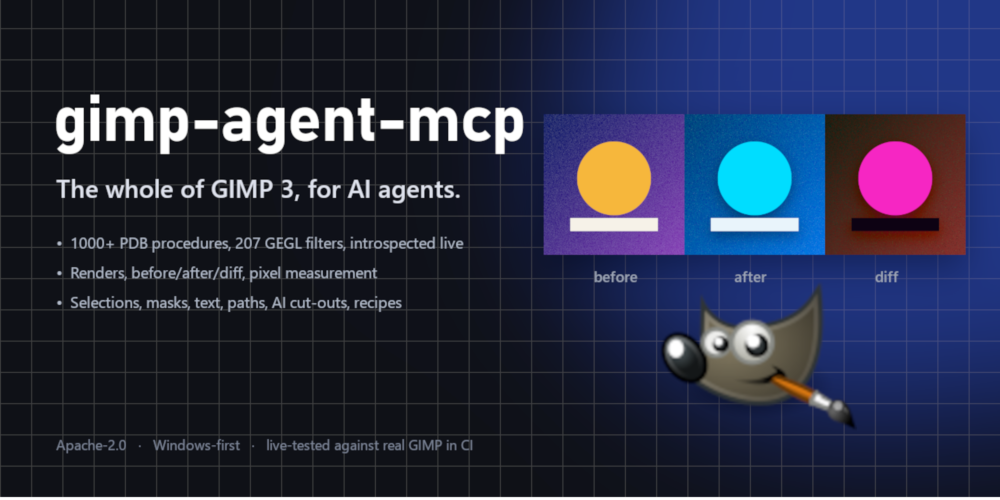
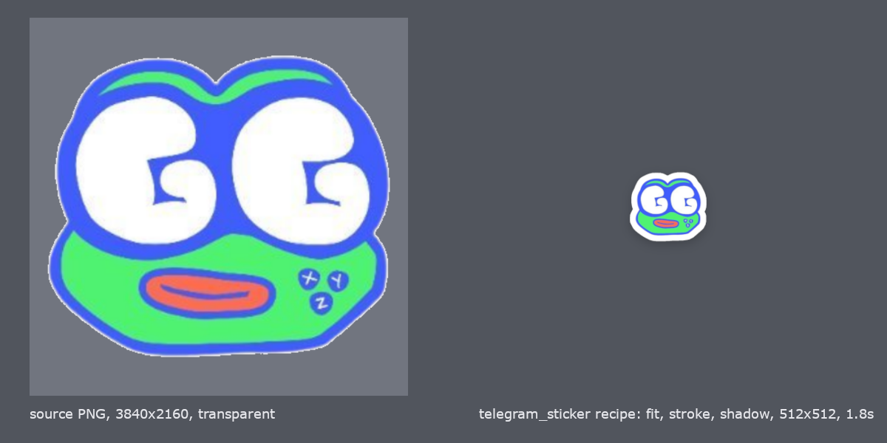

# gimp-agent-mcp



<!-- mcp-name: io.github.SarutobiSasuke8/gimp-agent-mcp -->

An MCP server that hands AI agents the whole of GIMP 3, with the eyes and hands to do detailed work.

Claude, Codex, Cursor and any other Model Context Protocol client can open images, inspect layers, call every one of GIMP's ~1000 Procedure Database functions, apply every GEGL filter destructively or as a non-destructive layer effect, measure pixels instead of guessing, see before/after/diff renders, cut subjects out with an AI segmentation model, draw text and paths, and run tested multi-step recipes over whole folders. Windows-first; macOS and Linux paths are implemented.


## Why this exists

GIMP 3 has a complete Python API through GObject Introspection. Earlier GIMP MCP servers wrapped a few dozen calls by hand, used Unix sockets that do not exist on Windows Python, and gave the agent no way to see or measure what it had just done. This server takes the opposite approach:

- **Generic, introspected access.** `gimp_pdb_search` -> `gimp_pdb_describe` -> `gimp_pdb_call` reaches any procedure with typed argument descriptions, enum choices and defaults pulled from GIMP at runtime. No hand-written wrapper goes stale when GIMP updates.
- **Every GEGL filter.** 200+ operations behind GIMP's Filters menu, with `mode="append"` for GIMP 3's non-destructive layer effects and `gimp_layer_effect` to edit them afterwards.
- **Sight and measurement.** `gimp_render` returns a PNG of the current state. `gimp_measure` reads the colour at a pixel, the bounding box of visible pixels, histograms and dominant colours. `gimp_snapshot` + `gimp_render_compare` show before, after and a pixel diff side by side.
- **Detailed work.** Selection in one tool (rect, ellipse, by colour, by alpha, from path, grow/shrink/feather), layer masks including raw mask pixels, text layers with fonts, vector paths that can be stroked, filled or turned into selections, and layer management.
- **AI cut-outs.** `gimp_remove_background` runs a segmentation model (rembg, optional extra) and writes the result as an editable layer mask or bakes it into alpha.
- **Recipes.** Repeatable jobs written once as Python that runs inside GIMP, with declared parameters, defaults and validation. Seven ship; `gimp_batch_recipe` runs one over a glob.
- **Windows-first transport.** TCP on `127.0.0.1` with a per-install token, because CPython on Windows has no `AF_UNIX`.
- **Escape hatch.** `gimp_run_python` executes Python inside GIMP with a persistent namespace. One environment variable disables it.

## Requirements

- GIMP 3.0 or newer (tested on 3.2.4). GIMP 2.10 will not work: it has no Python 3 API.
- Python 3.11+ and [uv](https://docs.astral.sh/uv/) on the machine that runs the MCP client.

## Quick start

```bash
git clone https://github.com/SarutobiSasuke8/gimp-agent-mcp.git
cd gimp-agent-mcp
uv sync                                # add --extra segmentation for AI cut-outs
uv run gimp-agent-mcp install-plugin   # copies the bridge plug-in into GIMP's plug-ins folder
uv run gimp-agent-mcp doctor           # shows what was found
uv run gimp-agent-mcp smoke            # launches headless GIMP and exercises every tool (24 checks with --segmentation)
```

Then add the server to your MCP client. For Claude Code, from the repo directory:

```bash
claude mcp add gimp -- uv run --directory "$(pwd)" gimp-agent-mcp serve
```

Or in `.mcp.json` / `claude_desktop_config.json` (see `.mcp.json.example`):

```json
{
  "mcpServers": {
    "gimp": {
      "command": "uv",
      "args": ["run", "--directory", "/absolute/path/to/gimp-agent-mcp", "gimp-agent-mcp", "serve"]
    }
  }
}
```

## Working in your own GIMP window

The agent works inside the GIMP you are using. Three ways to connect it:

- **Menu:** in an open GIMP, click **Filters > Development > Start Agent Bridge**. Every agent edit lands in your layer stack as an undoable step; keep editing by hand alongside it.
- **Shortcut:** `uv run gimp-agent-mcp shortcut` creates a "GIMP 3 (agent bridge)" launcher on your Desktop (a script in `~/.local/bin` on macOS/Linux). Start GIMP from it and the bridge is already on; no menu click.
- **Agent-driven:** `gimp_launch(mode="gui")` opens a window with the bridge running; `mode="headless"` runs `gimp-console` with no UI for batch work.

If two bridges are alive (a headless batch job and your window, say), the newer one takes the next free port and agents follow it. GIMP registers plug-ins at startup, so restart it once after `install-plugin`.

## Tools (33)

| Area | Tools |
|---|---|
| Help | `gimp_help` (topics: start, filters, colours, text, masks, paths, layers, measure, recipes, compose, errors) |
| Session | `gimp_status`, `gimp_launch`, `gimp_shutdown` |
| Images | `gimp_list_images`, `gimp_image_info`, `gimp_new_image`, `gimp_open`, `gimp_export` (with format options), `gimp_close_image` |
| Seeing | `gimp_render` (whole image, one layer, or a region), `gimp_snapshot`, `gimp_render_compare` (before / after / diff) |
| Measuring | `gimp_measure` (`color` at a point, `bbox` of visible pixels, `histogram`, `dominant` colours) |
| PDB | `gimp_pdb_search`, `gimp_pdb_describe`, `gimp_pdb_call` |
| Filters | `gimp_filter_search`, `gimp_filter_describe`, `gimp_apply_filter` (merge or append), `gimp_layer_effects`, `gimp_layer_effect` (edit or delete) |
| Detail work | `gimp_select`, `gimp_layer_mask`, `gimp_layer`, `gimp_text`, `gimp_list_fonts`, `gimp_path` |
| AI | `gimp_remove_background` (mask or apply; models u2net, isnet-general-use, u2net_human_seg, isnet-anime, silueta) |
| Code | `gimp_run_python` (disable with `GIMP_AGENT_ALLOW_PYTHON=0`) |
| Recipes | `gimp_list_recipes`, `gimp_run_recipe`, `gimp_batch_recipe` |

Argument conventions: images and items are integer ids; colours are `"#rrggbb"`, `"white"`, `"rgb(255,0,0)"` or `[r,g,b,a]`; enums are nicks like `"clip-to-image"` and unknown values return the valid list; dashes and underscores in names are interchangeable. `run-mode` defaults to non-interactive.

## Recipes

| Recipe | Purpose |
|---|---|
| `telegram_sticker` | Fit artwork into a 512x512 transparent canvas, add a white outline and a soft shadow, export PNG. |
| `web_optimise` | Scale to a maximum edge and export WebP/JPEG/PNG, lowering quality until the file fits a KB budget. |
| `icon_set` | Export a square source at every size in a list (favicon, app icons, PWA icons). |
| `watermark` | Overlay a text or image watermark in a corner or centre with opacity. |
| `contact_sheet` | Thumbnails of every image in a folder on a labelled grid. |
| `sprite_sheet_slice` | Cut a sprite sheet into fixed-size tiles, skipping empty ones. |
| `fit_and_export` | Scale to a maximum edge length and export by extension. |
| `compose` | Build a card or banner from a layout manifest: background, images, text, rounded rectangles, ellipses, per-item effects. Returns every item's bounding box. |



`compose` is the template engine: keep a brand manifest (logo path, fonts, colours, positions) and let the agent fill the text slots. `gimp_help("compose")` has a full example.

Recipes live in `src/gimp_agent_mcp/recipes/`. Each is a module with `DESCRIPTION`, `PARAMS` and `SOURCE`; see `docs/RECIPES.md` to add one.

## A detailed-work session, end to end

```text
gimp_open("photo.jpg")                                  -> image 1, layer 2
gimp_snapshot(1)                                        -> snapshot 3
gimp_remove_background(layer_id=2, mode="mask")         -> editable mask, subject bbox
gimp_select(1, mode="alpha", layer_id=2); gimp_select(1, mode="shrink", amount=2)
gimp_layer(action="new", image_id=1, fill="#f4f1ea", position=1)
gimp_apply_filter(2, "gegl:dropshadow", {"x": 0, "y": 6, "radius": 12, "opacity": 0.35}, mode="append")
gimp_text(image_id=1, text="SUMMER SALE", size=96, font="Montserrat Bold", color="#111111", x=40, y=40)
gimp_measure("bbox", layer_id=2); gimp_measure("dominant", image_id=1)
gimp_render_compare(1, 3)                               -> before | after | diff
gimp_export(1, "out/hero.webp", {"quality": 82})
```

## How it works

```text
MCP client  --stdio-->  gimp-agent-mcp (server.py)  --TCP 127.0.0.1:9877 + token-->  bridge plug-in inside GIMP 3
                                |                                                        |
                        rembg (optional)                              GLib main loop runs each request on the plug-in
                                                                      main thread against libgimp / GEGL / the PDB
```

The plug-in writes `agent-bridge.json` (port, token, pid) into GIMP's per-user config directory. The server reads it to connect. Details in `docs/ARCHITECTURE.md`.

## Testing

- `uv run pytest`: unit tests, no GIMP needed.
- `uv run gimp-agent-mcp smoke`: 23 live checks against a headless GIMP. Add `--segmentation` to include the AI cut-out (downloads a small model on first use).
- CI runs lint and unit tests on Ubuntu and Windows, and a second workflow installs real GIMP 3 on a Windows runner and runs the live smoke test on every push.

## Security

The bridge listens on loopback only and requires the token on every request. `gimp_run_python` and `gimp_pdb_call` are, by design, arbitrary code execution inside GIMP with the permissions of the user running it: give this server only to clients you trust with your files. Segmentation runs server-side and never sends pixels anywhere; the only network access in the project is rembg fetching its model once. See `SECURITY.md`.

## Provenance

Clean-room implementation under Apache-2.0. The author read the existing GPL and MIT GIMP MCP projects for lessons about the GIMP 3.2 API and copied no code from them.

## Status

`0.2.4`, beta. Listed in the [official MCP Registry](https://registry.modelcontextprotocol.io) as `io.github.SarutobiSasuke8/gimp-agent-mcp`. Verified end to end on Windows 11 with GIMP 3.2.4. macOS and Linux paths are implemented but not yet exercised on real machines; reports welcome. See `ROADMAP.md`.
